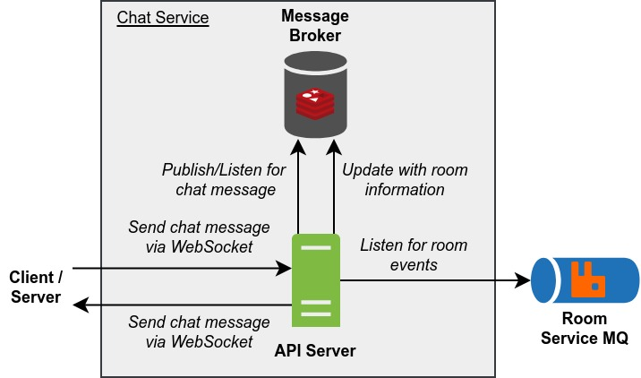

# PeerPrep Chat Service

Handles the storing retrieving, updating and deleting of questions.

The `docker-compose.yml` file starts 2 Docker containers.

- `chat_service_message_broker` - NoSQL Database for storing question repository.
- `chat_service_api` - REST API for interacting with the database.

## Table of Contents

- [Build Script](#build-script)
- [Architecture](#architecture)
- [Docker Images](#docker-images)
  - [API](#api)
- [Deployment](#deployment)
  - [Kubernetes Deployment](#kubernetes-deployment)
  - [Docker Compose Deployment](#docker-compose-deployment)
- [API](#api-1)
  - [Connecting to the Server](#connecting-to-the-server)
  - [Sending Messages](#sending-messages)
  - [Receiving Messages](#receiving-messages)

## Build Script

`build_images.sh` is a build script for building the Docker images and optionally pushing them to the container registry. To get more information about the script, run:

```
./build_images.sh -h
```

## Architecture



Legend:

- Start of arrow indicates request origin and end of arrow indicates request destination.
- `#505050` Dark grey items represents internal servers/containers.
- `#DA4026` Red items represents internal servers/containers that are temporary.
- `#7FBA42` Green items represents internal servers/containers that are exposed.
- `#2072B8` Blue items represents external servers/containers.

**API Server**

- Handles sending and receiving chat messages via WebSockets.
  - Note that since we are using Socket.io, should WebSocket connection fail, it will automatically fallback to long polling.
- Updates room information in the Message Broker when events are received from the Room Service MQ.
- Publishes chat messages to the Message Broker when chat messages are sent by a client/server.
- Sends chat messages to the appropriate client/server when chat messages are received from the Message Broker.
- Can be scaled horizontally.
- Corresponds to the [API](#api) docker image.

**Message Broker**

- Message broker for chat messages.

## Docker Images

### API

**Name:** ghcr.io/cs3219-ay2324s1-g04/peerprep_chat_service_api

**Description:** Runs the API.

**Environment Variables:**

- `REDIS_USERNAME` - Username for the Redis message broker.
- `REDIS_PASSWORD` - Password for the Redis message broker.
- `REDIS_HOST` - Address of the Redis message broker host.
- `REDIS_PORT` - Port the Redis message broker is listening on.
- `REDIS_SHOULD_USE_TLS` - Should the Redis message broker connection be secured with TLS. Set to "true" to enable.
- `ROOM_SERVICE_MQ_USER` - User on the Room Service MQ host.
- `ROOM_SERVICE_MQ_PASSWORD` - Password of the Room Service MQ.
- `ROOM_SERVICE_MQ_HOST` - Address of the Room Service MQ host.
- `ROOM_SERVICE_MQ_PORT` - Port the Room Service MQ is listening on.
- `ROOM_SERVICE_MQ_VHOST` - Vhost of the Room Service MQ.
- `ROOM_SERVICE_MQ_SHOULD_USE_TLS` - Should Room Service MQ connection be secured with TLS. Set to "true" to enable.
- `ROOM_SERVICE_MQ_EXCHANGE_NAME` - Name of the Room Service MQ exchange.
- `ROOM_SERVICE_MQ_QUEUE_NAME` - Name of the Room Service MQ queue.
- `API_PORT` - Port to listen on.

## Deployment

### Kubernetes Deployment

This is the main deployment method for production.

**Note:**

- The message broker is hosted externally, not within the Kubernetes cluster.

**Prerequisite**

- Docker images must be pushed to the container registry and made public.
  - To push to the container registry (assuming one has the necessary permissions), run: `./build_images.sh -p`
  - To make the images public, change the visibility of the image on [GitHub](https://github.com/orgs/CS3219-AY2324S1-G04/packages).
- Kubernetes cluster must be setup as specified in the [main repository](https://github.com/CS3219-AY2324S1/ay2324s1-course-assessment-g04#deployment).
- Room Service must be deployed within the Kubernetes cluster.

**Steps:**

1. Ensure the "peerprep" namespace has been created: `kubectl create namespace peerprep`
2. Navigate to the "kubernetes" directory: `cd kubernetes`
3. Deploy the Kubernetes objects: `./deploy.sh`
    - To delete the Kubernetes objects, run: `./delete.sh`

### Docker Compose Deployment

This is intended for development use only. It is meant to make developing other services easier.

**Note:**

- No horizontal auto scaling is provided.
- The message broker is created by Docker compose and data is not backed up.

**Prerequisite**

- Docker images must be built.
  - To build the images, run: `./build_images.sh`
- User Service must be deployed via Docker compose.

**Steps:**

1. Ensure that the "peerprep" network exist: `docker network create -d bridge peerprep`
2. Create the docker containers: `docker compose up`
    - To delete the docker containers, run: `docker compose down`

## API

The server uses Socket.IO to communicate with clients. The Socket.IO library can be found [here](https://socket.io/).
To install the Socket.IO client library for TypeScript, run the following command:

```bash
npm install socket.io-client @types/socket.io-client
```

### Connecting to the Server

The server is hosted on `localhost:9000` by default. By default, the client should connect to the server using websocket
connection. The client passes the room ID as a query parameter when connecting to the server. The room ID is needed to
identify the room that the client is connecting to and its intended recipient. The client can connect to the server
using the following code:

```typescript
import { io } from "socket.io-client";

const socket = io("http://localhost:9005", {
  query: {
    roomId: "room-id",
    userId: "user-id",
    userName: "user-name",
  },
});
```

### Sending Messages

The client can send messages to the server using the `sendMessage` event. The client should pass the message as a
string.
The server will then broadcast the message to all clients in the room. The client can send messages using the following
code:

```typescript
socket.emit("sendMessage", "Hello World!");
```

### Receiving Messages

The client can receive messages from the server using the `receiveMessage` event. The server will broadcast the message
to
all clients in the room. The client can receive messages using the following code:

```typescript
socket.on("receiveMessage", (messagePayload: {   message: string, userName: string; }) => {
  // display message and username
  console.log(messagePayload.message);
  console.log(messagePayload.userName);
});
```
